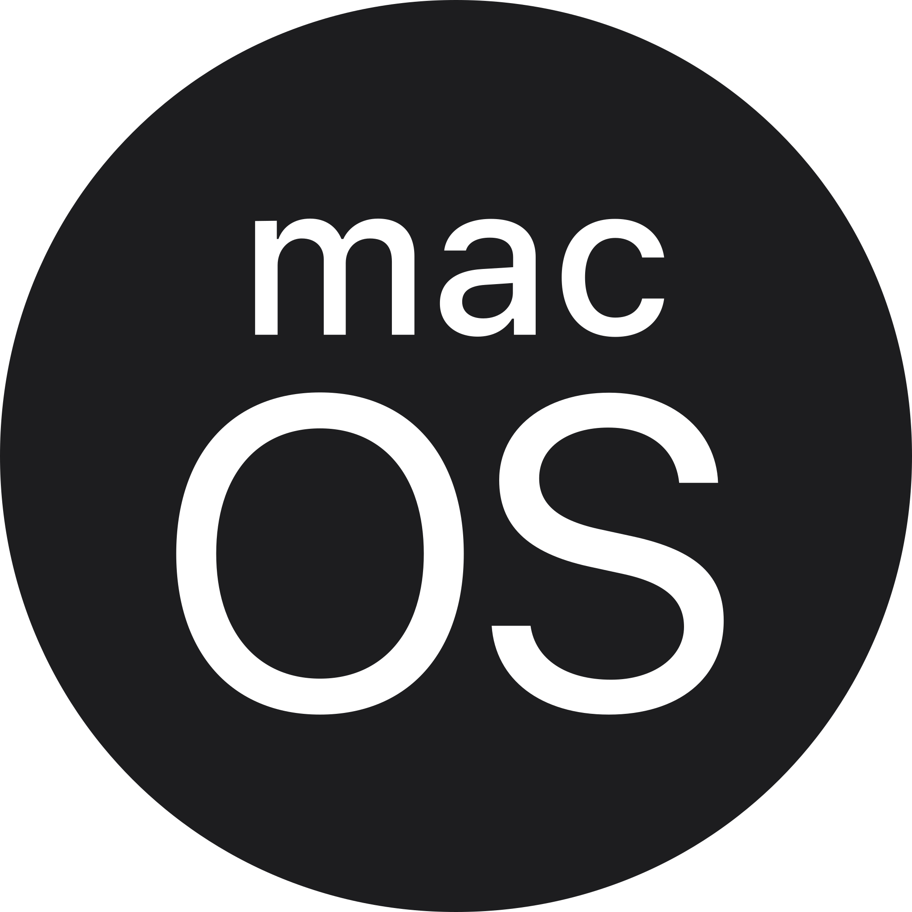
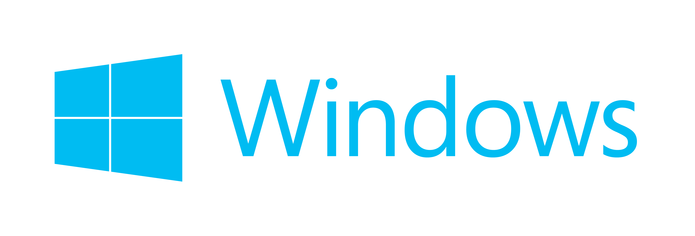
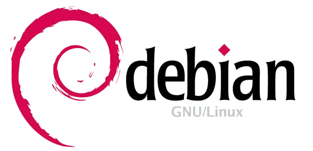
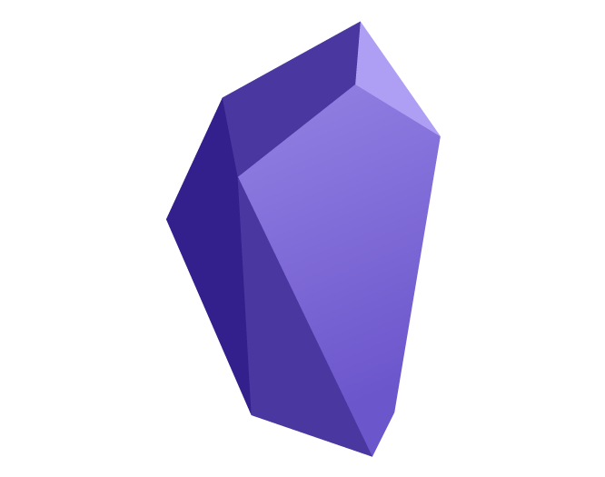
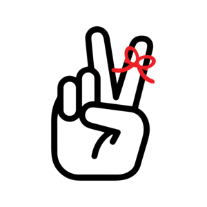
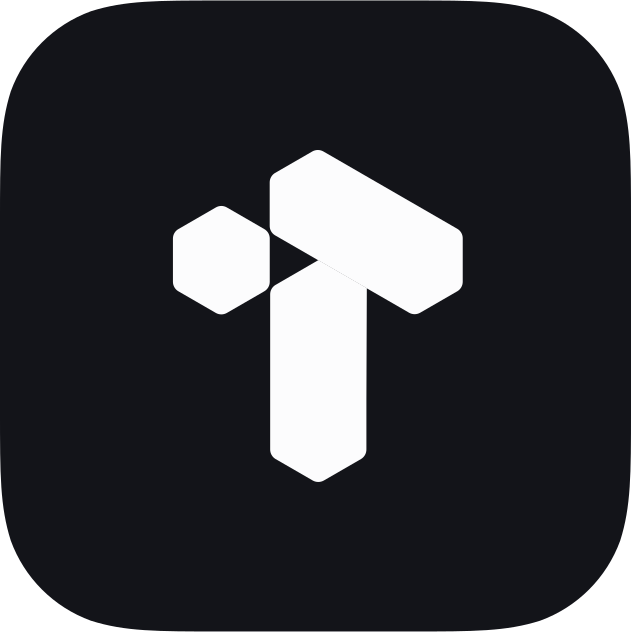
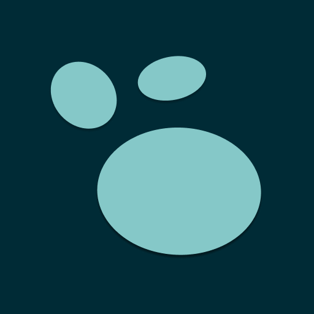

[](https://github.com/akosbalasko/yarle#readme)
[](https://github.com/akosbalasko/yarle/graphs/commit-activity)
[](https://github.com/akosbalasko/yarle/blob/master/LICENSE)

<br><br><br>
## Download YARLE, the **ULTIMATE CONVERTER OF EVERNOTE** notes here:
<br>
<div id="downloadApp"></div>

|  |  |  |  |
|---|---|---|---|
| [Get YARLE for Mac](https://github.com/akosbalasko/yarle/releases/latest/download/yarle-evernote-to-md_mac_x64.zip)| <a class="button" href="https://github.com/akosbalasko/yarle/releases/latest/download/yarle-evernote-to-md_win_x64.exe">Get YARLE for Windows</a>| [Get YARLE for Linux (.rpm)](https://github.com/akosbalasko/yarle/releases/latest/download/yarle-evernote-to-md_linux_x86_64.rpm)| [Get YARLE for Debian (.deb)](https://github.com/akosbalasko/yarle/releases/latest/download/yarle-evernote-to-md_linux_amd64.deb)

<br><br>

## Features:

### Yarle can convert:
- :memo: Any text
- :memo: All metadata: original creation time, last modification time, tags, GPS location, notebook name, source URL
- :link: External links
- :link: Internal links among Evernote notes
- :computer: Codeblocks
- :framed_picture: Inline Images
- :paperclip: Attachments
- :page_facing_up: Webclips

### Works with:
- :notebook: single enex file (one notebook exported from Evernote)
- :books: or a folder of enex files supported (several notebooks exported and placed into the same folder locally)

### Highly customizable:


- :rocket: Creates Markdown files matching to user-defined templates, see Templates introduced. See [How to use templates with YARLE](Templates.md) for details.
- :bulb: Metadata support: Puts `title`, `creation time`, `update time`, `tags`, and `latlong` `source`, `notebook`, `link to original html` meta-information into md as metadata. (To set them, please set up a custom template)
- :hammer: Updates md files' creation, access, and modification timestamps according to the notes' original create/update/modification time.
- :hammer: Organizes all attachments into a _resources subfolder (to keep the notes' folder as simple as possible).


## To where can I import the converted notes? 

Any other note taking application which recognizes notes in standard markdown, like NotePlan or Craft, but Yarle supports some others that has specific format requirements too. These are: 

<a href="https://github.com/kmaasrud/awesome-obsidian" rel="Awesome Obsidian">Obsidian</a>

<a href="https://github.com/logseq/awesome-logseq" rel="Awesome Logseq">LogSeq</a>

<a href="https://tana.inc" rel= "Tana">Tana</a> (check details and limitations <a href="#tana_limitations">here</a>)
 
<a href="https://heptabase.com/" rel="Heptabase">Heptabase</a>


## Feedback, Appreciation, Donation:
If you have an idea on how to improve the tool or face any problems, feel free to raise an issue, or even contribute!
If you like the product, you can give a star here on github, or you can <a href="https://www.buymeacoffee.com/akosbalasko" target="_blank"></a>

### Yarle's supporters said: 

<!--START_SECTION:buy-me-a-coffee--><div> from <b>Someone</b> </div>  <div><i>Thanks, this really helped me out of evernote!</i></div><br>
<div> from <b>john@thebeard.org</b> </div>  <div><i>YARLE has just allowed me to transfer several years-worth of Evernote notes to Obsidian painlessly and astonishingly quickly. Your work has made my day. Thank you.</i></div><br>
<div> from <b>@opscat</b> </div>  <div><i>Thanks so much!</i></div><br><!--END_SECTION:buy-me-a-coffe-->

## Proud to be suggested by: 

<a href="https://github.com/kmaasrud/awesome-obsidian" rel="Awesome Obsidian">

</a>
<a href="https://www.twosapp.com/import" rel="Twos App">

</a>
<a href="" rel="Tana Inc.">

</a>
<a href="https://github.com/logseq/awesome-logseq" rel="Awesome Logseq">

</a>
<a href="https://help.noteplan.co/article/33-how-to-import-notes" rel="Noteplan help page">

</a>
<a href="https://support.craft.do/hc/en-us/articles/4411890239121-Import-documents-into-Craft" rel="Craft.do support page">

</a>
<a href="https://wiki.dendron.so/notes/700b02fc-1e6c-46b1-8d68-5d8e17a55d33/" rel="Dendron import proposal">

</a>

## Instructions

<a href="#downloadApp">Download the application</a> matching with your Operating system and double-click on it. (On mac, you need to right-click + Run to Open it, because Apple prevents to directly run an application downloaded from Internet)

https://user-images.githubusercontent.com/11886731/213943491-97211b41-c130-4b6b-a1e9-1fc360741ff7.mov

 In order to perform conversion into Logseq format, please choose Logseq as Target format in the configuration panel, then choose the type of your notes (Journal Notes or Pages). For Logseq all the other options have already been pre-configured.


## Using Yarle via command line
Just open a terminal, specify config options in a config file (options detailed in [Configuration](#Configuration)) and type the following:

```javascript
npx -p yarle-evernote-to-md@latest yarle --configFile <path_to_your_file e.g. ./config.json>
```

## Yarle intro and usage videos on Youtube:
<a href="https://www.youtube.com/watch?v=EPMkm5zRIts">How to migrate notes from Evernote to Obsidian (using Yarle)</a><br>
<a href="https://www.youtube.com/watch?v=gZxMz67uYHg">YARLE: A lifeline to escape from Evernote</a>

## Configuration:

To configure Yarle, you must create a config file. By default it looks like this:

```json
{
    "enexSources": [
       "/absolute-path-of-your-enex-dir/test-template.enex"
       ],
    "templateFile": "/absolute-path-of-your-template-dir/sampleTemplate.tmpl",
    "outputDir": "/path-of-your-desired-output-folder",
    "isZettelkastenNeeded": false,
    "useZettelIdAsFilename": false,
    "plainTextNotesOnly": false,
    "skipWebClips": false,
    "useHashTags": true,
    "outputFormat": "StandardMD",
    "taskOutputFormat": "StandardMD",
    "urlEncodeFileNamesAndLinks": false,
    "skipEnexFileNameFromOutputPath": false,
    "monospaceIsCodeBlock": false,
    "keepMDCharactersOfENNotes": false,
    "keepOriginalAmountOfNewlines": false,
    "addExtensionToInternalLinks": true,
    "trimStartingTabs": false,
    "nestedTags": {
      "separatorInEN": "_",
      "replaceSeparatorWith": "/",
      "replaceSpaceWith": "-"
   },
   "replacementCharacterMap": {
      "<": "_",
      ">": "_",
      ":": "_",
      "\"": "_",
      "/": "_",
      "\\": "_", 
      "|": "_",
      "?": "_",
      "*": "_"
    },
   "resourcesDir": "resources",
   "turndownOptions": {
      "headingStyle": "atx"
   },
   "dateFormat": "YYYY-MM-DD",
   "haveEnexLevelResources": true,
   "haveGlobalResources": false,
   "useUniqueUnknownFileNames": false,
   "useLevenshteinForLinks": false,
    "logseqSettings":{
        "journalNotes": false
    },
   "obsidianSettings": {
      "omitLinkDisplayName": false
    }

}
```
The following configurational properties are available:
|
|Property Name| Property value | Meaning |
|-------------|----------------|---------|
|```enexSources```| multiple enex files, or a folder of the enex files(if you specify it via command line) | specifies the exported Evernote notebook(s) as an absolute path|
|```templateFile``` | path of your custom template file | if its not specified, a [default template](https://github.com/akosbalasko/yarle/blob/master/src/utils/templates/default-template.ts) will be used
|```outputDir``` | path to your output dir (absolute or relative) | this is the main output dir where the extracted markdown files and the external resources, images, pdf-s are going to be created|
|```resourcesDir``` | `_resources` | subdir where attachments/external resources will be placed
|```isZettelkastenNeeded``` |  true or false | puts Zettelkasten Id (based on time of creation) at the beginning of the file name|
|```useZettelIdAsFilename``` | true or false | Note files are named by their creation date (those are interpreted as zettelIds)|
|```plaintextNotesOnly``` |  true or false | skips any notes with attachments (e.g. notes containing pictures)|
|```useHashTags```|  true or false | whether to add the pound sign in front of tags|
|```outputFormat```|  ObsidianMD or StandardMD | generates internal file links and highlights in Obsidian-style: highlights are going to be bounded by `==` instead of \` characters, file links are going to be as follows: `![[file-name]]` instead of ``. Possible values: `ObsidianMD` to get Obsidian-style notes, `StandardMD` or skip it completely, if you prefer Standard Markdown format.|
|```haveEnexLevelResources```|  true or false | stores note resources on global _resources folder per enex export if enabled |
|```monospaceIsCodeBlock```| true or false | if it's true then all deepest elements with monospace font style is recognized as Codeblocks|
| ```dateFormat``` | string | ISO 8601 specification of the expected date format (e.g. YYYY-MM-DD)
|```keepMDCharactersOfENNotes```| true or false | set it true, if you used Markdown format in your EN notes|
| ```nestedTags``` | it's a complex property contains the following subitems: "separatorInEN", "replaceSeparatorWith" and  "replaceSpaceWith" | separatorInEN stores the tag separator used in Evernote, replaceSeparatorWith is the string to what separatorInEN should be replaced to, and replaceSpaceWith is the string to what the space character should be replaced to in the tags. For example using the default settings a tag ```tag1_sub tag of tag1``` is going to be converted to ```tag1/sub-tag-of-tag1```
| ```keepImageSize``` | `ObsidianMD` or `StandardMD` | preserve an image's width and height in the chosen format when specified
| ```urlEncodeFileNamesAndLinks``` | true or false | URL-encodes linked file names and internal EN links . e.g "linked file.jpg" will be converted to "linked%20file.jpg"
| ```sanitizeResourceNameSpaces``` | true or false | Replace spaces in resource names with the `replacementChar`. e.g "linked file.jpg" will be converted to "linked_file.jpg"
| ```replacementChar``` | string | the replacement character. e.g "linked*file.jpg" will be converted to "linked_file.jpg". It defaults to "_"
| ```replacementCharacterMap``` | JSON Object | it contains character key-value pairs, the keys will be replaced by the proper values in the filename 
| ```keepOriginalAmountOfNewlines``` | true or false | keep the original amount of newlines, default is false, when the multiple newlines are collapsed to one.
| ```generateNakedUrls``` | true or false | if it's true, Yarle generates 'naked' external Urls without any extra characters. If its false, external Urls are wrapped by  '<' and '>' characters
| ```addExtensionToInternalLinks``` | true or false | adds '.md' extensions at the end of internal file links, to make them recognizable by DevonThink and other tools
| ```turndownOptions``` | `{...}` | additional configuration options for [turndown](https://github.com/mixmark-io/turndown#options), e.g., `{ "bulletListMarker": "-" }` (only in Yarle config file, not desktop app)
| ```obsidianSettings``` | `{...}` | settings for Obsidian output. Currently, ```omitLinkDisplayName``` is supported. If set to `true` links will be of the form `[[foo]]`. Conversely they will be of the form `[[foo|bar]]`. Defaults to `false`.
| ```logseqSettings``` | `{...}` | settings for Logseq output, currently ```journalNotes``` property is supported, if it is set to `true`, then the notes will be converted to be recognizable by Logseq as Journal notes, the notes will be named by their creation date and they will be collected under `journal` folder. If it is `false`, then they will be converted to be `Pages` (e.g. simple notes, collected in `pages` folder).
| ```taskOutputFormat``` | `ObsidianMD` or `StandardMD` | Output format of Evernote v10+ tasks. ObsidianMD will connvert tasks to match with Obsidian Tasks plugin's requirements. StandardMD will create plain tasks, loosing many features like reminders or due dates.
| ```obsidianTaskTag``` | string | a tag to put to a task converted from Evernote v10+ tasks. Optional by Obsidian Tasks plugin, pls check the details there. 
| ```trimStartingTabs``` | true or false | Removes the tab characters from the beginning of every line in a note. It is meaningful, because Obsidian recognizes tabs as codeblocks by default and blocks recognition of links (for instance) in the line   
|```useUniqueUnknownFileNames``` | boolean | generates a couple of random characters at the end of the resource file names if the exact name cannot be recognised. For instance: unknown_filename-d2fd86c3.pdf
|```useLevenshteinForLinks```| boolean| it applies the link to the note with the filename that has the closest Levenshtein distance to the text of the link
Metadata settings can be set via the template.


## Note links over notebooks? No problem, here is what to do: 

In order to minimize the wrong conversion of links due to duplicated note names, you need to do the followings:

1. Before export your notes: select all withing a notebook
2. Create a Table of Contents note
3. Export the notebook together with the TOC file 
4. Start yarle and convert your notes

##   Converting notes to Tana 

Yarle converts your notes to Tana Internal Format. To achieve this, the only thing you need to do differently than the default usage is to the output format as Tana Internal Format. The conversion will produce one file only called `notes-in-TIF.json`. It will contain all of your notes in Tana Internal Format, then you can import this file to Tana. 

### Limitations
<div id="tana_limitations"><div>

Currently Yarle (or any other converter), cannot convert images into Tana Internal Format. Moreover Yarle converts Evernote tables to Tana as plain text.

Once Tana Internal Format supports these features, we are glad to fill these gaps in the conversion. 

##  Converting notes to Heptabase

Just select Heptabase as output format, and then a zip is going to be created as a result of the conversion that contains all of your notes with images, everything together, prepared to be uploaded to Heptabase. 
