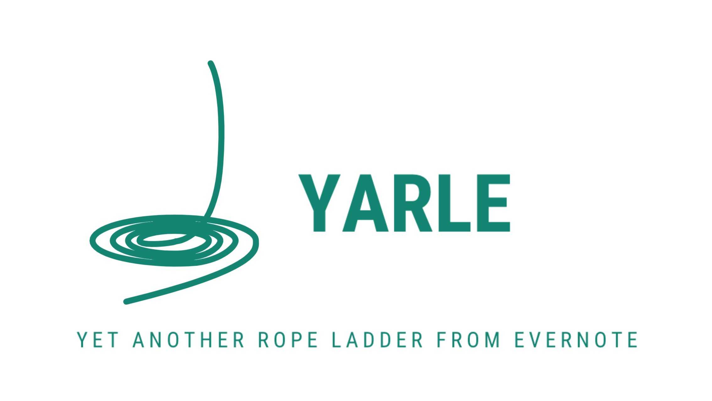

  

[](https://github.com/akosbalasko/yarle#readme)
[](https://github.com/akosbalasko/yarle/graphs/commit-activity)
[](https://github.com/akosbalasko/yarle/blob/master/LICENSE)


Yarle is the ultimate converter of Evernote notes to Markdown.


## Features:

### Yarle can convert:
- :memo: Any text
- :memo: All metadata: original creation time, last modification time, tags, GPS location, notebook name, source URL
- :link: External links
- :link: Internal links among Evernote notes
- :computer: Codeblocks
- :framed_picture: Inline Images
- :paperclip: Attachments
- :page_facing_up: Webclips

### Works with:
- :notebook: single enex file (one notebook exported from Evernote)
- :books: or a folder of enex files supported (several notebooks exported and placed into the same folder locally)

### Highly customizable:


- :rocket: Creates Markdown files matching to user-defined templates, see Templates introduced. See [How to use templates with YARLE](Templates.md) for details.
- :bulb: Metadata support: Puts `title`, `creation time`, `update time`, `tags`, and `latlong` `source`, `notebook`, `link to original html` meta-information into md as metadata. (To set them, please set up a custom template)
- :hammer: Updates md files' creation, access, and modification timestamps according to the notes' original create/update/modification time.
- :hammer: Organizes all attachments into a _resources subfolder (to keep the notes' folder as simple as possible).

## Binaries: 

[Windows](https://github.com/akosbalasko/yarle/releases/download/v4.1.0/yarle-evernote-to-md-4.1.0.Setup.exe)

[Linux](https://github.com/akosbalasko/yarle/releases/download/v4.1.0/yarle-evernote-to-md-4.1.0-1.x86_64.rpm)

[Debian](https://github.com/akosbalasko/yarle/releases/download/v4.1.0/yarle-evernote-to-md_4.1.0_amd64.deb)

[Mac](https://github.com/akosbalasko/yarle/releases/download/v4.1.0/yarle-evernote-to-md-darwin-x64-4.1.0.zip)


## Instructions

Download the desktop app for your platform, and follow the instructions there.


## Prerequisite for legacy versions (below 4.0.0):

 - Required [Install Node.js](https://nodejs.org/en/download/) version 10.22.1 or higher.

## No-install execution
Just open a terminal, specify config options in a config file (options detailed in [Configuration](#Configuration)) and type the following:

```javascript
npx -p yarle-evernote-to-md@latest yarle --configFile <path_to_your_file e.g. ./config.json>
```

## Configuration:

To configure Yarle, you must create a config file. By default it looks like this:

```
{
    "enexSource": "/absolute-path-of-your-enex-dir/test-template.enex",
    "templateFile": "/absolute-path-of-your-template-dir/sampleTemplate.tmpl",
    "outputDir": "/path-of-your-desired-output-folder",
    "isZettelkastenNeeded": false,
    "plainTextNotesOnly": false,
    "skipWebClips": false,
    "useHashTags": true,
    "outputFormat": "StandardMD",
    "urlEncodeFileNamesAndLinks": false,
    "skipEnexFileNameFromOutputPath": false,
    "haveEnexLevelResources": false,
    "monospaceIsCodeBlock": false,
    "keepMDCharactersOfENNotes": false,
    "keepOriginalAmountOfNewlines": false,
    "addExtensionToInternalLinks": true,
    "nestedTags": {
      "separatorInEN": "_",
      "replaceSeparatorWith": "/",
      "replaceSpaceWith": "-"
   }
}
```
The following configurational properties are available:
|
|Property Name| Property value | Meaning |
|-------------|----------------|---------|
|```enexSource```| your enex file or the folder of your enex files | specifies the exported Evernote notebook(s) as an absolute path|
|```templateFile``` | path of your custom template file | if its not specified, a [default template](https://github.com/akosbalasko/yarle/blob/master/src/utils/templates/default-template.ts) will be used
|```outputDir``` | path to your output dir (absolute or relative) | this is the main output dir where the extracted markdown files and the external resources, images, pdf-s are going to be created|
|```resourcesDir``` | `_resources` | subdir where attachments/external resources will be placed
|```isZettelkastenNeeded``` |  true or false | puts Zettelkasten Id (based on time of creation) at the beginning of the file name|
|```plaintextNotesOnly``` |  true or false | skips any notes with attachments (e.g. notes containing pictures)|
|```useHashTags```|  true or false | whether to add the pound sign in front of tags|
|```outputFormat```|  ObsidianMD or StandardMD | generates internal file links and highlights in Obsidian-style: highlights are going to be bounded by `==` instead of \` characters, file links are going to be as follows: `![[file-name]]` instead of ``. Possible values: `ObsidianMD` to get Obsidian-style notes, `StandardMD` or skip it completely, if you prefer Standard Markdown format.|
|```haveEnexLevelResources```|  true or false | stores note resources on global _resources folder per enex export if enabled |
|```monospaceIsCodeBlock```| true or false | if it's true then all deepest elements with monospace font style is recognized as Codeblocks|
| ```dateFormat``` | string | ISO 8601 specification of the expected date format (e.g. YYYY-MM-DD)
|```keepMDCharactersOfENNotes```| true or false | set it true, if you used Markdown format in your EN notes|
| ```nestedTags``` | it's a complex property contains the following subitems: "separatorInEN", "replaceSeparatorWith" and  "replaceSpaceWith" | separatorInEN stores the tag separator used in Evernote, replaceSeparatorWith is the string to what separatorInEN should be replaced to, and replaceSpaceWith is the string to what the space character should be replaced to in the tags. For example using the default settings a tag ```tag1_sub tag of tag1``` is going to be converted to ```tag1/sub-tag-of-tag1```
| ```keepImageSize``` | `ObsidianMD` or `StandardMD` | preserve an image's width and height in the chosen format when specified
| ```urlEncodeFileNamesAndLinks``` | true or false | URL-encodes linked file names and internal EN links . e.g "linked file.jpg" will be converted to "linked%20file.jpg" 
| ```keepOriginalAmountOfNewlines``` | true or false | keep the original amount of newlines, default is false, when the multiple newlines are collapsed to one. 
| ```generateNakedUrls``` | true or false | if it's true, Yarle generates 'naked' external Urls without any extra characters. If its false, external Urls are wrapped by  '<' and '>' characters 
 
| ```addExtensionToInternalLinks``` | true or false | adds '.md' extensions at the end of internal file links, to make them recognizable by DevonThink and other tools 
| ```turndownOptions``` | `{...}` | additional configuration options for [turndown](https://github.com/mixmark-io/turndown#options), e.g., `{ "bulletListMarker": "-" }` (only in Yarle config file, not desktop app) 

Metadata settings can be set via the template.
